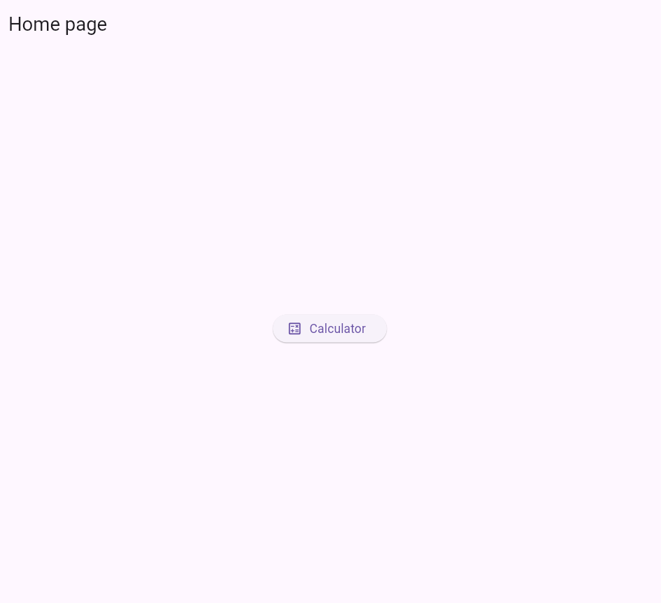
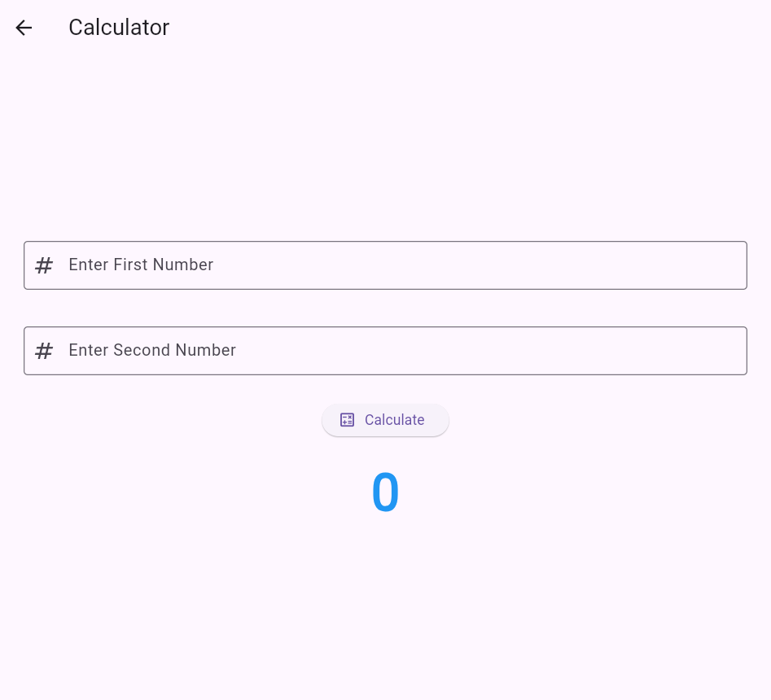
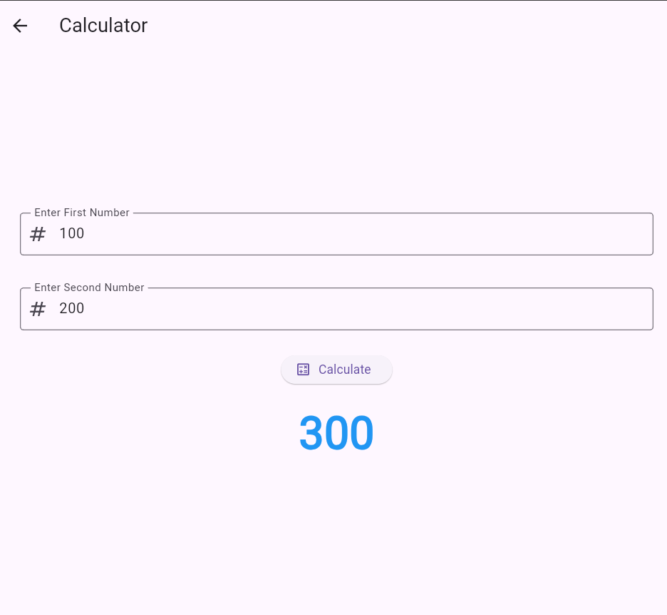

# **🐬Flutter State Manangement App**

A Flutter-based mobile application showcasing popular tourist destinations in Bangladesh. The app features a grid-based UI displaying beautiful images, descriptions, and navigation to detailed pages for each place.

# **Screenshots**

## **Home Page**

## **Calculate Page**

## **Calculation**

## 😱 **Live Demo**
https://faysalcsecu.github.io/flutter_state_management/
## ✨ Features

- 🗺️ **Displays famous tourist spots** in a grid layout
- 👆 **Click on any place** to see its detailed description and image
- 🔔 **FlutterToast notifications** for feedback
- 🔄 **Smooth navigation** between pages
- 🎨 **Modern UI** with Google Fonts

## 👤 Author

**Faysal Bin Alauddin**  
📧 Email: faysalf716@gmail.com  
🔗 GitHub: [Faysal Bin Alauddin](https://github.com/faysalcsecu)  
🔗 LinkedIn: [Faysal Bin Alauddin](https://www.linkedin.com/in/faysal-bin-alauddin-4815a92a7/) 

